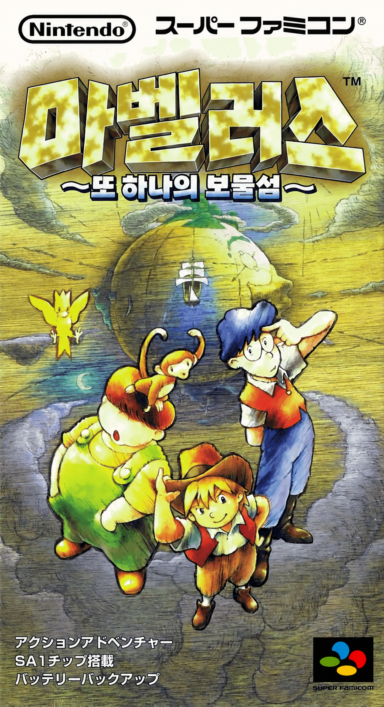

<p align="center"></p>

# 마벨러스 또 하나의 보물섬 한글화

닌텐도가 1996년에 슈퍼 패미컴으로 낸 어드벤처 게임 『マーヴェラス ～もうひとつの宝島～』(일본판)의 한글 패치 제작 프로젝트입니다.

> **현재 버전: v0.3.0-beta (공개 테스트판)**
> 대사 3,067개 번역과 기계 검사를 마쳤고, 제1장 중후반까지 실제 플레이로 확인했습니다. 전체 사람 검수 전이므로 오역·화면 깨짐 제보를 받습니다. 아래 [패치 적용](#패치-적용-공개-테스트판)과 [제보](#제보)를 보세요.

## 버전

- `0.x.0`: 아래 단계 하나를 끝낼 때마다 올립니다.
- `0.x.y`: 범위 변화 없이 오류만 고친 경우 올립니다.
- `0.x.0-beta`: 전체 사람 검수 전에 제보를 받으려고 공개하는 테스트판입니다(D16).
- `1.0.0`: 사람 검수를 마친 첫 정식 패치입니다.

모든 버전은 테스트 전체 통과, 원본에서의 빌드 성공, 전원 투입부터 첫 텐트까지 재실행 정상, 문서 갱신을 공통 조건으로 합니다.

| 버전 | 조건 | 상태 |
|---|---|---|
| v0.1.0 | 공통 조건 | 완료 |
| v0.2.0 | 진행 없이 확인할 수 있는 항목 정리: 그래픽 텍스트 목록의 미조사 항목(raw 뱅크 0x59·0x55) 판정, 저장 화면 실화면 확인, LZ 248·LZ 11 판정 | 완료 |
| v0.2.1 | 대사 속 아이콘 `[FE6D48]`·`[FE6D4A]`를 한 줄 팀워크·아이템으로 교체 (원본 가타카나가 남아 있던 것) | 완료 |
| v0.2.2 | 긁는 카드 그림의 スカ를 꽝으로 교체 (장면 50) | 완료 |
| v0.3.0-beta | 공개 테스트판: `--policy beta` 빌드 통과(모든 메시지 번역·초벌 검수 완료), IPS 배포, 제보 창구 안내 | **현재** |
| v0.9.0 | 처음부터 엔딩까지 플레이 QA(진행 차단·의미 오류 0건). 이때 진행이 필요한 실화면 확인을 함께 한다: 아이템 메뉴, `通信中`, 챕터 선택·설정 화면, 큰 외침 그림, 엔딩 크레딧. 사람 최종 검수 완료 | 예정 |
| v1.0.0 | `--policy release` 빌드 통과, IPS 패치와 패치 노트 공개 | 예정 |

## 진행 상황

| 항목 | 상태 |
|---|---|
| 대사 전체 (3,067 메시지) | 번역·검수 반영 완료, 사람 최종 승인 대기 |
| 고정폭 16px 한글 글꼴 + 8px 반각 띄어쓰기 | 완료 (두 렌더러 모두) |
| 팀 이름 한글 입력 (160음절) | 완료 |
| 메뉴 글리프 풀·아이템 이름 | 완료 (저장 화면은 실화면 확인, 챕터 선택·설정 화면은 미확인) |
| 타이틀 로고·부제, 인트로 | 완료 |
| 명령 패널, 말풍선 안내, 상태창 이름, 상단 로고, 큰 외침 그림 | 완료 (큰 외침은 실화면 미확인) |
| 조사 화면 그림 글자 (포스터, 칠판, 석판, 편지, 수수께끼, 간판, 지도, 쪽지) | 완료, 런타임 화면 확인 |
| 엔딩 스태프 크레딧 (직함만 한글, 인명 유지) | 완료, 엔딩 실화면 미확인 |
| `通信中` 표시 | v0.9 플레이 QA로 연기 (진행 필요) |
| 전체 플레이 QA | 제1장 중후반까지 확인, 이후는 제보로 진행 |

## 패치 적용 (공개 테스트판)

배포 파일은 IPS 패치(`marvelous_ko_v0.3.0-beta.ips`)뿐입니다. 롬 파일은 배포하지 않습니다.

1. 정당하게 소유한 일본판 원본 롬을 준비합니다. 헤더 없는 3MB(3,145,728바이트) 파일이어야 합니다.
   - CRC32 `CEDF3BA7`
   - SHA-256 `555d78c9e4667bee7fb503efd87ed9fc82c55b0e8bde034a10aa2a53967762c5`
   - 512바이트 헤더(SMC 헤더)가 붙은 파일이면 먼저 헤더를 제거하세요.
2. IPS 패치 도구(Floating IPS, Lunar IPS, ROM Patcher JS 등)로 원본 롬에 적용합니다. 결과물은 4MB가 됩니다.
3. SA-1 칩을 지원하는 에뮬레이터에서 실행합니다. Snes9x, bsnes 계열에서 확인했습니다.
   - 안드로이드 RetroArch + bsnes 코어에서 상태 저장 후 홈 화면에 갔다 오면 화면이 검게 멈추는 증상이 있습니다. 원본 롬에서도 같은 증상이 나서 패치 문제는 아닌 것으로 보입니다. 이 경우 Snes9x 코어를 권장하며, 게임 안의 기록(SELECT)도 함께 해 두세요.

## 제보

오역, 어색한 문장, 글자 깨짐, 진행 막힘은 **돈골's 한글팩의 제보 기능**으로 알려 주세요. 다음 정보가 있으면 빨리 고칠 수 있습니다.

- 장면 위치(몇 장, 어느 장소, 누구와의 대화)
- 화면 스크린샷
- 문제 내용(기대한 문장이나 동작)
- 에뮬레이터와 코어 이름

## 알려진 한계

- 전체 사람 검수 전입니다. 오역이나 어색한 문장이 남아 있을 수 있습니다.
- 다음 화면은 아직 실화면 확인을 못 했습니다: 아이템 메뉴의 아이템 이름, 챕터 선택·설정 화면, `通信中` 표시, 큰 외침 그림, 엔딩 크레딧.
- 메뉴 글자는 원본 글자칸을 공유하는 구조라 일부 문구를 줄여 썼습니다(예: 저장 화면 "SELECT로 종료", "1로 기록.").
- 장식용 그림 글자(영화 포스터의 작은 가나 등)는 원문 그대로입니다.

세부 기록은 [`docs/`](docs/)에 있습니다.

- [`docs/decisions.md`](docs/decisions.md): 사람이 정한 방침 (번역 범위, 고유명사, 말투 등)
- [`docs/survey.md`](docs/survey.md): ROM 구조 조사 결과
- [`docs/style.md`](docs/style.md): 번역 가이드
- [`docs/graphics_text.md`](docs/graphics_text.md): 그래픽 텍스트 목록과 상태

## 빌드

원본 ROM과 글꼴은 저장소에 들어 있지 않습니다. 직접 준비해야 합니다.

1. **원본 ROM**: 일본판 헤더 없는 3MB 이미지를 `rom/baserom.sfc`로 둡니다.
   빌드는 SHA-256이 `555d78c9e4667bee7fb503efd87ed9fc82c55b0e8bde034a10aa2a53967762c5`인지 확인하고, 다르면 멈춥니다.
2. **글꼴**: [갈무리(Galmuri)](https://github.com/quiple/galmuri) BDF 파일(`Galmuri11-Bold.bdf`, `Galmuri11.bdf`, `Galmuri9.bdf`, `Galmuri7.bdf`, `Galmuri14.bdf`)을 이 저장소와 같은 위치의 `../galmuri/` 폴더에 둡니다.
3. **Python 3**과 `Pillow`, `numpy`, `pytest`를 설치합니다.

```sh
python -m pytest -q tests/          # 테스트 (rom/baserom.sfc가 있어야 대부분 실행됨)
python tools/build.py               # build/marvelous_ko_v<버전>.sfc, .ips, .report.json 생성
python tools/check_ko.py text/ko/*.json   # 번역 파일 기계 검사
```

- `tools/build.py --policy release`는 모든 번역이 `distribution_eligible` 상태일 때만 통과합니다.
- 빌드는 원본에서 매번 새로 만들고, 겹치는 쓰기나 예상과 다른 원본 바이트가 있으면 실패합니다.

## 구조

| 경로 | 내용 |
|---|---|
| `tools/` | 추출(`mvscript.py`), 인코딩(`koenc.py`), 글꼴(`kfont.py`), LZ 압축(`lz2.py`), 그래픽 텍스트(`title_logo.py`, `scene_text.py`, `riddle_text.py`, `credits_text.py` 등), 제품 빌드(`build.py`) |
| `tests/` | 단위·통합 테스트 (pytest) |
| `text/ko/` | 번역 파일 (메시지별 원문 기준선, 번역, 검수 상태) |
| `data/` | 문자표, 용어집, 이름 입력표, 레이아웃 정책, UI 글리프 풀 |
| `docs/` | 조사·결정·번역 가이드·그래픽 텍스트 목록 |
| `cover_ko.png`, `title_ko.png` | 한글 표지와 타이틀 로고 원본 이미지 |

## 저장소에 넣지 않는 것

- 원본 ROM, 그리고 ROM에서 만든 결과물(`build/`의 `.sfc`·`.ips`)
- 원문 대사 전체 덤프(`text/script_jp.*`): 원본 ROM이 있으면 `tools/mvscript.py`로 다시 만들 수 있습니다.
- 작업용 스크립트와 에뮬레이터 상태(`work/`)

## 권리

『マーヴェラス ～もうひとつの宝島～』의 권리는 Nintendo에 있습니다.
이 저장소는 원본 게임 데이터를 배포하지 않습니다. 패치를 쓰려면 정당하게 소유한 원본이 필요합니다.
갈무리 글꼴은 SIL Open Font License 1.1을 따릅니다.
